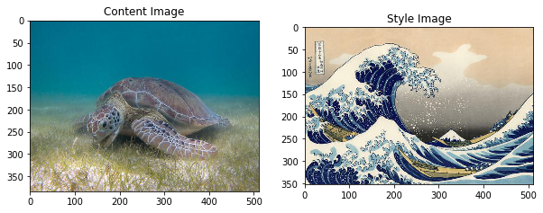
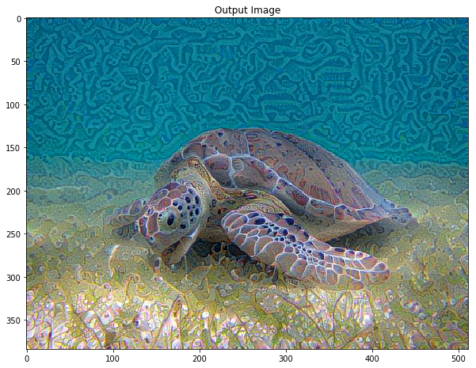

[](https://opensource.org/licenses/Apache-2.0)
[](https://github.com/devMichani/nano-db-manager.git)

# neural-style-art (NST - Neural Style Transfer )
Neural Style Transfer refers to a kind of software algorithm that manages images or videos, to transfer the visual style of another image. NST algorithms are characterized by their use of deep neural networks for image transformation.

# Requirements

The project can be used with **python2.7** for to build. The most recommended is to use version 2.7 within a virtual environment, since this version is already deprecated, you can install python2.7 on a virtual environment you can use virtualenv or pipenv. To run the version of the script with tkinter you need the **tk** package. Also to run this project successfully, you need to have jupyter notebook installed on your computer

# Pip packages
 - __jupyterlab__
 - __matplotlib__
 - __numpy__
 - __pandas__
 - __Pyllow__
 - __tensorflow__
 - __tensorflow-gpu__
 - __keras__
 
Works Optimizer Adam from tensorflow Again Xd

```python
# works Adam YEA!
best, best_loss = run_style_transfer(content_path, style_path, num_iterations=5)
```


```python
Image.fromarray(best)
```


```python
def show_results(best_img, content_path, style_path, show_large_final=True):
    plt.figure(figsize=(10, 5))
    content = load_img(content_path) 
    style = load_img(style_path)
    
    plt.subplot(1, 2, 1)
    imshow(content, 'Content Image')

    plt.subplot(1, 2, 2)
    imshow(style, 'Style Image')

    if show_large_final: 
        plt.figure(figsize=(10, 10))

    plt.imshow(best_img)
    plt.title('Output Image')
    plt.show()
```


```python
show_results(best, content_path, style_path)
```




