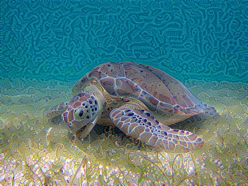
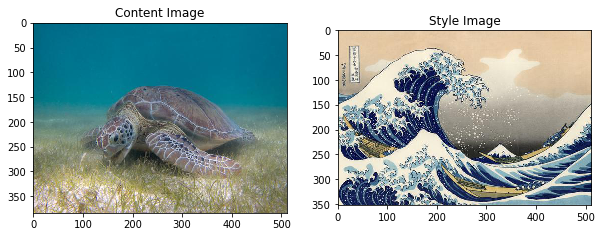
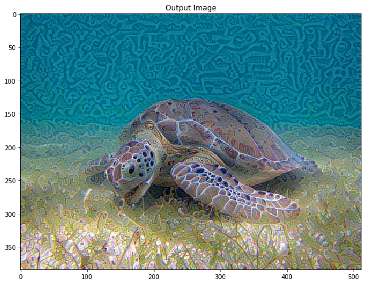

```python
# Importando bibliotecas para el uso del sistema operativo
import os
import sys
```


```python
# Definiendo la ruta de las imagenes y asegurando la existencia de dicha ruta
img_dir = '/home/d4rk6h05t/Projects/python/neural-style-art/img'
if not os.path.exists(img_dir):
    os.makedirs(img_dir)
```


```python
# Importando las bibliotecas
# - Matplotlib( Manejador de graficos )
# - Pandas( Manejador de estructuras como  tablas numéricas y series temporales )
# - Numpy ( Extencion de python agregar mayor soporte a los vectores y matrices )
# - PIL (Python Imaging Library antes PILLOW manipulador de archivos de imagenes )
# - time ( Manipulador de tareas temporales )
# - functools ( Manejador de funciones de orden superior )
import matplotlib.pyplot as plt
import matplotlib as mpl
mpl.rcParams['figure.figsize'] = (10,10)
mpl.rcParams['axes.grid'] = False
import pandas as pd
import numpy as np
from PIL import Image
import time
import functools
```


```python
# Tensor ( Entidad algebraica de varios componentes, que generaliza los conceptos de escalar, vector y matriz )
# - Tensorflow ( Aprendizaje automático a través de un rango de tareas con  capacidad de construir y entrenar 
#               redes neuronales para detectar y descifrar patrones y correlaciones, análogos al aprendizaje y 
#               razonamiento usados por los humanos. )
# - Keras ( Manipulador de redes neuronales, Ayuda a experimentar con redes de Aprendizaje Profundo )
# Keras es una biblioteca a nivel de modelo, que proporciona bloques de construcción de alto nivel para el 
# desarrollo de modelos de aprendizaje profundo. No maneja operaciones de bajo nivel tales como productos 
# tensores, convoluciones, etc. En su lugar, se basa en una biblioteca especializada y bien optimizada de 
# manipulación de tensores para hacerlo, sirviendo como el "motor backend" de Keras. En lugar de elegir una 
# sola librería de tensores y hacer que la implementación de Keras se vincule a esa librería, Keras maneja el 
# problema de una manera modular, y varios motores backend diferentes se pueden conectar sin problemas a Keras.

# - tensorflow.python.keras.preprocessing : Keras data preprocessing utils.
# tensorflow.python.keras (Models) : Manipulador del modelo ( Red neuronal Profunda )
# tensorflow.python.keras (losses) : Una función de pérdida ( o función de objetivo, o función de puntuación 
#                                   de optimización es uno de los dos parámetros necesarios para compilar un modelo )
# tensorflow.python.keras (layers) : Ayuda Manipular las capas ( funciones con tareas especificas. Estás funciones se conocen como capas )
# - Buscar patrones
# Las capas que buscan patrones son realmente las encargadas de aprender que patrón hay relevante en la entrada 
# de esa capa. Estos patrones que aprenden se conocen como pesos. Para comparar la entrada con los pesos se 
# usa lo que se conoce como producto de señales.

# - Transformar los datos, llamadas capas de activación.
# Transforman los datos
# Por otro lado están las capas que transforman los datos llamadas capas de activación estás llevan los datos a nuevos
# espacios, los condensan y los anulan. Pero sobretodo tienen una propiedad muy importante: son funciones no-lineales.
# Una red neuronal debe ser una Universal Function Approximators, que viene a decir que 
# “tiene que permitir aproximar cualquier función”.

# Perceptrón (Neurona Artificial)
# De los dos anteriores conceptos nace el perceptrón que combina ambos para crear una neurona artificial.

# tensorflow.python.keras (backend) : Keras tiene 3 implementaciones de backend : TensorFlow, Theano y CNTK.
# tensorflow.keras.optimizers.Adam :
# Adam es un algoritmo de optimización de reemplazo para el descenso de gradiente estocástico para entrenar 
# modelos de aprendizaje profundo. Adam combina las mejores propiedades de los algoritmos AdaGrad y RMSProp 
# para proporcionar un algoritmo de optimización que puede manejar gradientes escasos en problemas de ruido.
# tensorflow.python.ops Confusion_matrix
# Calcula la matriz de confusión a partir de predicciones y etiquetas.
# Las columnas de la matriz representan las etiquetas de predicción y las filas representan la
# etiquetas de verdad. La matriz de confusión es siempre una matriz 2-D de forma `[n, n]``,
# donde `n` es el número de etiquetas válidas para una tarea de clasificación dada. Ambos
# y las etiquetas deben ser matrices 1-D de la misma forma para que esto sea posible.
# para que funcione.

import tensorflow as tf
from tensorflow.python.keras.preprocessing import image as kp_image
from tensorflow.python.keras import models 
from tensorflow.python.keras import losses
from tensorflow.python.keras import layers
from tensorflow.python.keras import backend as K

from tensorflow.keras.optimizers import Adam 
from tensorflow.python.ops import confusion_matrix
from tensorflow.python.ops import math_ops
```

    WARNING:tensorflow:Falling back to tensorflow client, its recommended to install the cloud tpu client directly with pip install cloud-tpu-client .


```python
# Importaciones necesarias para cargar la ejecucion ansiosa de tensorflow
# La ansiosa ejecución de TensorFlow es un entorno de programación imperativo que evalúa las operaciones 
# inmediatamente, sin construir gráficos: las operaciones devuelven valores concretos en lugar de construir 
# un gráfico computacional para ejecutarse más tarde. Esto hace que sea fácil comenzar con los modelos 
# TensorFlow y de depuración, y también reduce el número de calderas. Para seguir con esta guía, 
# ejecute los ejemplos de código que aparecen a continuación en un intérprete interactivo de python
from __future__ import absolute_import, division, print_function, unicode_literals
# Cargar el kernel de tensorflow2
try:
  # %tensorflow_version only exists in Colab.
  %tensorflow_version 2.x  #gpu
except Exception:
    pass
#  Cprofile : proporcionan un perfil determinista de los programas de Python. Un perfil es un conjunto de 
# estadísticas que describe con qué frecuencia y durante cuánto tiempo se ejecutan varias partes del programa. 
# Estas estadísticas se pueden formatear en informes a través del módulo pstats.
import cProfile
```


```python
tf.executing_eagerly() # test tensorflow eager
```


    True


```python
# Testeando Eager execution 
print("Eager execution: {}".format(tf.executing_eagerly()))
```

    Eager execution: True


```python
# Definicion de la ruta de imagen contenido e imagen de estilo
content_path = '/home/d4rk6h05t/Projects/python/neural-style-art/img/turtle_to_style_kanagawa/turtle.jpg'
style_path = '/home/d4rk6h05t/Projects/python/neural-style-art/img/turtle_to_style_kanagawa/kanagawa.jpg'
```


```python
# Simple funcion para Cargar la imagen recibe una ruta como parametro 
def load_img(path_to_img):
    max_dim = 512
    img = Image.open(path_to_img)
    long = max(img.size)
    scale = max_dim/long
    img = img.resize((round(img.size[0]*scale), round(img.size[1]*scale)), Image.ANTIALIAS)
    img = kp_image.img_to_array(img)
    # We need to broadcast the image array such that it has a batch dimension 
    img = np.expand_dims(img, axis=0)
    return img
```


```python
# Muestra la imagen precargada
def imshow(img, title=None):
    # Remove the batch dimension
    out = np.squeeze(img, axis=0)
    # Normalize for display 
    out = out.astype('uint8')
    plt.imshow(out)
    if title is not None:
        plt.title(title)
        plt.imshow(out)
```


```python
# Muestra las imagenes a trabajar
plt.figure(figsize=(10,10))

content = load_img(content_path).astype('uint8')
style = load_img(style_path).astype('uint8')

plt.subplot(1, 2, 1)
imshow(content, 'Content Image')

plt.subplot(1, 2, 2)
imshow(style, 'Style Image')
plt.show()
```


```python
# Carga y procesa la imagen
def load_and_process_img(path_to_img):
    img = load_img(path_to_img)
    img = tf.keras.applications.vgg19.preprocess_input(img)
    return img
```


```python
# Con el fin de obtener tanto el contenido como las representaciones de estilo de nuestra imagen, 
# veremos algunas capas intermedias dentro de nuestro modelo. Las capas intermedias representan mapas 
# de características que se van ordenando cada vez más a medida que se profundiza. En este caso, estamos 
# utilizando la arquitectura de red VGG19, una red de clasificación de imágenes preformada. Estas capas 
# intermedias son necesarias para definir la representación del contenido y el estilo de nuestras imágenes.
# Para una imagen de entrada, intentaremos hacer coincidir las representaciones de estilo y contenido 
# correspondientes en estas capas intermedias.

def deprocess_img(processed_img):
    x = processed_img.copy()
    if len(x.shape) == 4:
        x = np.squeeze(x, 0)
    assert len(x.shape) == 3, ("Input to deprocess image must be an image of "
"dimension [1, height, width, channel] or [height, width, channel]")
    if len(x.shape) != 3:
        raise ValueError("Invalid input to deprocessing image")
    
    # perform the inverse of the preprocessiing step
    x[:, :, 0] += 103.939
    x[:, :, 1] += 116.779
    x[:, :, 2] += 123.68
    x = x[:, :, ::-1]
    x = np.clip(x, 0, 255).astype('uint8')
    return x
```


```python
# Dentro de nuestra red de clasificación de imágenes preconfigurada nos permiten definir las representaciones de
# estilo y contenido. A un alto nivel, este fenómeno puede explicarse por el hecho de que para que una red realice
# la clasificación de imágenes (para lo cual nuestra red ha sido entrenada), debe entender la imagen. Esto implica
# tomar la imagen cruda como píxeles de entrada y construir una representación interna a través de transformaciones
# que convierten los píxeles de la imagen cruda en una comprensión compleja de las características presentes dentro de la imagen. Esto es también en parte la razón por la que las redes neuronales convolucionales son capaces de generalizarse bien: son capaces de capturar las invariantes y definir características dentro de las clases (por ejemplo, gatos vs. perros) que son agnósticas al ruido de fondo y otras molestias. Así, en algún punto entre la entrada de la imagen en bruto y la salida de la etiqueta de clasificación, el modelo sirve como un extractor de características complejas; por lo tanto, accediendo a capas intermedias, podemos describir el contenido y el estilo de las imágenes de entrada.


# Content layer where will pull our feature maps
content_layers = ['block5_conv2'] 

# Style layer we are interested in
style_layers = ['block1_conv1',
                'block2_conv1',
                'block3_conv1', 
                'block4_conv1', 
                'block5_conv1'
               ]

num_content_layers = len(content_layers)
num_style_layers = len(style_layers)
```


```python
def get_model():
    """ Creates our model with access to intermediate layers. 
  
      This function will load the VGG19 model and access the intermediate layers. 
      These layers will then be used to create a new model that will take input image
      and return the outputs from these intermediate layers from the VGG model. 
  
      Returns:
        returns a keras model that takes image inputs and outputs the style and 
          content intermediate layers. 
    """
    # Load our model. We load pretrained VGG, trained on imagenet data
    vgg = tf.keras.applications.vgg19.VGG19(include_top=False, weights='imagenet')
    vgg.trainable = False
    # Get output layers corresponding to style and content layers 
    style_outputs = [vgg.get_layer(name).output for name in style_layers]
    content_outputs = [vgg.get_layer(name).output for name in content_layers]
    model_outputs = style_outputs + content_outputs
    # Build model 
    return models.Model(vgg.input, model_outputs)
```


```python
def get_content_loss(base_content, target):
    return tf.reduce_mean(tf.square(base_content - target))
```


```python
def gram_matrix(input_tensor):
    # We make the image channels first 
    channels = int(input_tensor.shape[-1])
    a = tf.reshape(input_tensor, [-1, channels])
    n = tf.shape(a)[0]
    gram = tf.matmul(a, a, transpose_a=True)
    return gram / tf.cast(n, tf.float32)

def get_style_loss(base_style, gram_target):
    """Expects two images of dimension h, w, c"""
    # height, width, num filters of each layer
    # We scale the loss at a given layer by the size of the feature map and the number of filters
    height, width, channels = base_style.get_shape().as_list()
    gram_style = gram_matrix(base_style)
  
    return tf.reduce_mean(tf.square(gram_style - gram_target))# / (4. * (channels ** 2) * (width * height) ** 2)
```


```python
def get_feature_representations(model, content_path, style_path):
    """Helper function to compute our content and style feature representations.

    This function will simply load and preprocess both the content and style 
    images from their path. Then it will feed them through the network to obtain
    the outputs of the intermediate layers. 
    
    Arguments:
        model: The model that we are using.
        content_path: The path to the content image.
        style_path: The path to the style image
    
    Returns:
        returns the style features and the content features. 
      """
    # Load our images in 
    content_image = load_and_process_img(content_path)
    style_image = load_and_process_img(style_path)
  
    # batch compute content and style features
    style_outputs = model(style_image)
    content_outputs = model(content_image)
  
    # Get the style and content feature representations from our model  
    style_features = [style_layer[0] for style_layer in style_outputs[:num_style_layers]]
    content_features = [content_layer[0] for content_layer in content_outputs[num_style_layers:]]
    return style_features, content_features
```


```python
def compute_loss(model, loss_weights, init_image, gram_style_features, content_features):
    """This function will compute the loss total loss.
      Arguments:
        model: The model that will give us access to the intermediate layers
               loss_weights: The weights of each contribution of each loss function. 
               (style weight, content weight, and total variation weight)
               init_image: Our initial base image. This image is what we are updating with 
               our optimization process. We apply the gradients wrt the loss we are 
               calculating to this image.
      gram_style_features: Precomputed gram matrices corresponding to the 
                           defined style layers of interest.
      content_features: Precomputed outputs from defined content layers of interest.
      
      Returns:
        returns the total loss, style loss, content loss, and total variational loss
  """
    style_weight, content_weight = loss_weights
  
    # Feed our init image through our model. This will give us the content and 
    # style representations at our desired layers. Since we're using eager
    # our model is callable just like any other function!
    model_outputs = model(init_image)
  
    style_output_features = model_outputs[:num_style_layers]
    content_output_features = model_outputs[num_style_layers:]
  
    style_score = 0
    content_score = 0

    # Accumulate style losses from all layers
    # Here, we equally weight each contribution of each loss layer
    weight_per_style_layer = 1.0 / float(num_style_layers)
    for target_style, comb_style in zip(gram_style_features, style_output_features):
        style_score += weight_per_style_layer * get_style_loss(comb_style[0], target_style)
    
    # Accumulate content losses from all layers 
    weight_per_content_layer = 1.0 / float(num_content_layers)
    for target_content, comb_content in zip(content_features, content_output_features):
        content_score += weight_per_content_layer* get_content_loss(comb_content[0], target_content)
  
    style_score *= style_weight
    content_score *= content_weight

    # Get total loss
    loss = style_score + content_score 
    return loss, style_score, content_score
```


```python
def compute_grads(cfg):
    with tf.GradientTape() as tape: 
        all_loss = compute_loss(**cfg)
    # Compute gradients wrt input image
    total_loss = all_loss[0]
    return tape.gradient(total_loss, cfg['init_image']), all_loss
```


```python
import IPython.display

def run_style_transfer(content_path, 
                       style_path,
                       num_iterations=1000,
                       content_weight=1e3, 
                       style_weight=1e-2): 
    # We don't need to (or want to) train any layers of our model, so we set their
    # trainable to false. 
    model = get_model() 
    for layer in model.layers:
        layer.trainable = False
  
    # Get the style and content feature representations (from our specified intermediate layers) 
    style_features, content_features = get_feature_representations(model, content_path, style_path)
    gram_style_features = [gram_matrix(style_feature) for style_feature in style_features]
  
    # Set initial image
    init_image = load_and_process_img(content_path)
    init_image = tf.Variable(init_image, dtype=tf.float32)
    # Create our optimizer # now use tf.optimizers.Adam 
    opt = tf.optimizers.Adam(learning_rate=5, beta_1=0.99, epsilon=1e-1)

    # For displaying intermediate images 
    iter_count = 1
  
    # Store our best result
    best_loss, best_img = float('inf'), None
  
    # Create a nice config 
    loss_weights = (style_weight, content_weight)
    cfg = {
      'model': model,
      'loss_weights': loss_weights,
      'init_image': init_image,
      'gram_style_features': gram_style_features,
      'content_features': content_features
    }
    
    # For displaying
    num_rows = 2
    num_cols = 5
    display_interval = num_iterations/(num_rows*num_cols)
    start_time = time.time()
    global_start = time.time()
  
    norm_means = np.array([103.939, 116.779, 123.68])
    min_vals = -norm_means
    max_vals = 255 - norm_means   
  
    imgs = []
    for i in range(num_iterations):
        grads, all_loss = compute_grads(cfg)
        loss, style_score, content_score = all_loss
        opt.apply_gradients([(grads, init_image)])
        clipped = tf.clip_by_value(init_image, min_vals, max_vals)
        init_image.assign(clipped)
        end_time = time.time() 
    
        if loss < best_loss:
            # Update best loss and best image from total loss. 
            best_loss = loss
            best_img = deprocess_img(init_image.numpy())

        if i % display_interval== 0:
            start_time = time.time()
      
            # Use the .numpy() method to get the concrete numpy array
            plot_img = init_image.numpy()
            plot_img = deprocess_img(plot_img)
            imgs.append(plot_img)
            IPython.display.clear_output(wait=True)
            IPython.display.display_png(Image.fromarray(plot_img))
            print('Iteration: {}'.format(i))        
            print('Total loss: {:.4e}, ' 
                  'style loss: {:.4e}, '
                  'content loss: {:.4e}, '
                  'time: {:.4f}s'.format(loss, style_score, content_score, time.time() - start_time))
    print('Total time: {:.4f}s'.format(time.time() - global_start))
    IPython.display.clear_output(wait=True)
    plt.figure(figsize=(14,4))
    for i,img in enumerate(imgs):
        plt.subplot(num_rows,num_cols,i+1)
        plt.imshow(img)
        plt.xticks([])
        plt.yticks([])
      
    return best_img, best_loss
```


```python
# works Adam YEA!
best, best_loss = run_style_transfer(content_path, style_path, num_iterations=5)
```


```python
Image.fromarray(best)
```





```python
def show_results(best_img, content_path, style_path, show_large_final=True):
    plt.figure(figsize=(10, 5))
    content = load_img(content_path) 
    style = load_img(style_path)
    
    plt.subplot(1, 2, 1)
    imshow(content, 'Content Image')

    plt.subplot(1, 2, 2)
    imshow(style, 'Style Image')

    if show_large_final: 
        plt.figure(figsize=(10, 10))

    plt.imshow(best_img)
    plt.title('Output Image')
    plt.show()
```


```python
show_results(best, content_path, style_path)
```








```python

```


```python

```


```python

```


```python

```


```python

```


```python

```


```python

```


```python

```


```python

```


```python

```


```python

```


```python

```


```python

```


```python

```


```python

```
